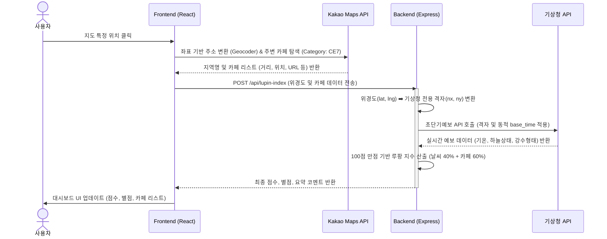

# LupinMap (루팡 지도)

> **"사무실에서 벗어나 카페로!"**  
> 루팡 지도는 직장인들이 사무실을 벗어나 근처 카페로 농땡이(루팡) 치러 가기 얼마나 좋은지 분석해 주는 위치 기반 웹 서비스입니다.
[Preview]
 


## 주요 기능 (Key Features)

- **실시간 루팡 지수 산출 알고리즘**
  - **기상청 실제 데이터 연동**: 현재 온도가 쾌적한지, 비가 오지 않는지 등을 분석하여 '날씨 만족도'를 계산합니다.
  - **카카오 장소 검색 API 연동**: 반경 500m 이내의 '진짜 카페' 개수를 실시간으로 스캔하여 '카페 밀집도'를 계산합니다. 주변에 카페가 0개일 경우 패널티 로직이 적용됩니다.
- **다이나믹 지도 탐색 & 상호작용**
  - 지도의 원하는 곳을 아무 데나 **클릭**하면 즉시 해당 구역의 지수를 재계산.
  - 강남, 여의도, 용산, 판교, 성수 등 주요 오피스 상권으로 한 번에 날아가는 **퀵 핫스팟 버튼** 제공.
  - 브라우저 GPS를 이용해 내 실제 사무실 위치를 찾아가는 **내 위치 탐색 기능**.
- **주변 카페 탐색 및 길찾기 연동**
  - 대시보드에서 주변 검색된 카페 목록과 거리를 스크롤로 한눈에 확인 가능.
  - 지도 마커나 리스트의 버튼을 누르면 **카카오맵 상세 페이지**로 이동.
- **모바일 최적화 UI**
  - 모바일 환경에서도 화면을 가리지 않도록 **반응형(Responsive) 폭 조절** 및 **패널 접기/펼치기** 기능

## 기술 스택 (Tech Stack)

### BFF(Backend For Frontend) pattern
- **Framework**: React 19, Vite, Vanilla CSS, KakaoMap JavaScript API (Services, Clusterer)
- **Backend**: Node.js, Express.js (axios,dotenv)
- **External APIs**: 
  - 카카오맵 API (`Local`, `Geocoder`, 지도 렌더링)
  - 공공데이터포털 기상청 API (초단기예보 `getUltraSrtFcst`)

##  로컬 실행 방법 (How to Run)

### 환경 변수 설정 (.env)
백엔드 폴더(`backend/.env`)와 프론트엔드 폴더(`frontend/.env`)에 각각 API 키를 등록해야 합니다.

**`backend/.env`**
```env
PORT=5001
WEATHER_API_KEY=발급받은_기상청_API_디코딩키
```

**`frontend/.env`**
```env
VITE_KAKAO_MAP_KEY=발급받은_카카오_JavaScript_API_키
```

### 백엔드 실행
```bash
cd backend
npm install (최초 1회만)
node server.js
# 정상 작동 시 "Server is running on port: 5001" 출력
```

### 프론트엔드 실행
새로운 터미널 창을 열고 아래 명령어를 실행합니다.
```bash
cd frontend
npm install (최초 1회만)
npm run dev
# 기본적으로 http://localhost:5173 에 서버가 열립니다.
```

> **모바일 테스트 팁**: 스마트폰에서 테스트하려면, `npm run dev` 실행 후 터미널에 뜨는 `Network` 주소(예: `http://192.168.0.x:5173/`)로 스마트폰 브라우저에서 접속하시면 됩니다. (App.jsx 내부에서 동적 호스트네임을 사용하므로 별도의 코드 수정 없이 백엔드와 연결됩니다.)

## 디렉토리 구조 (Directory Structure)

```text
LupinMap/
├── backend/
│   ├── routes/
│   │   └── api.js              # 루팡 지수 산출 API 엔드포인트
│   ├── utils/
│   │   ├── dfs_xy_conv.js      # 기상청 (위경도 -> nx,ny) 격자 변환 유틸
│   │   ├── lupinCalculator.js  # 날씨 및 카페 수 기반 점수 알고리즘
│   │   └── weatherApi.js       # 기상청 외부 API 호출 로직
│   ├── server.js               # Express 서버 진입점
│   └── package.json
│
└── frontend/
    ├── index.html              # 카카오맵 스크립트 주입
    ├── src/
    │   ├── components/
    │   │   ├── Dashboard.jsx   # 점수, 별점, 카페 리스트 표시 패널 (반응형)
    │   │   └── Map.jsx         # 카카오맵 렌더링, 장소 탐색 로직
    │   ├── App.jsx             # 최상위 상태 관리 및 백엔드 통신
    │   └── index.css           # 전역 스타일 및 글래스모피즘 UI
    └── package.json
```

## 데이터 플로우 및 시퀀스 다이어그램 (Data Flow)


## 핵심 문제 해결

### 문제 1: 기상청 API의 독자적인 좌표계 문제
- **원인**: 프론트엔드(카카오맵)에서 얻는 위치 정보는 WGS84 표준 위경도(Latitude, Longitude) 방식이지만, 기상청 API는 자체적인 'LCC 격자(nx, ny)' 좌표계만을 요구했습니다.
- **해결 과정**: 
  - 서버 측에 람베르트 원추 정각 투영법(Lambert Conformal Conic Projection)을 수학적으로 구현한 `dfs_xy_conv.js` 알고리즘 모듈을 적용했습니다.
  - 이를 통해 사용자가 지도 어디를 누르든 백엔드에서 실시간으로 해당 위치의 기상청 전용 격자 번호로 동적 변환하여 API를 호출하도록 설계했습니다.
- **결과**: 대한민국 내 어떤 위치든 클릭 즉시 오차 없이 해당 지역의 날씨 데이터를 파싱할 수 있게 되었습니다.

### 문제 2: 예보 API의 엄격한 발표 시간(Base Time) 규격
- **원인**: 기상청 초단기예보는 24시간 열려있는 것이 아니라, 매시간 **45분**에만 최신 데이터가 발표되며, 조회 시간(`base_time`)은 매시 30분 단위로 입력해야 하는 까다로운 규칙이 있었습니다. (단순히 현재 시간을 넣으면 API 에러 발생)
- **해결 과정**:
  - `Date` 객체를 활용해 현재 시간을 KST로 고정하고, `minutes`가 45분 미만일 경우 `hours`를 1시간 차감하여 이전 시간대(`xx30`) 데이터를 안전하게 조회하는 동적 시각 계산 로직을 구현했습니다. (`weatherApi.js`)
- **결과**: 사용자가 언제 접속하더라도 서버가 크래시되지 않고 항상 '조회 가능한 가장 최신 시간의 예보'를 무중단으로 받아옵니다.

### 문제 3: 점수 산출 알고리즘의 정밀도 한계
- **원인**: 초기에는 기온, 하늘상태, 카페 갯수를 곧바로 1~5점의 별점으로 바꾼 뒤 가중치를 곱해 총점을 구했습니다. (예: 3별점 * 0.4 + 4별점 * 0.6). 이렇게 하니 종합 점수가 몇 가지 고정된 숫자로만 산출되어, 동네별 디테일한 비교가 불가능했습니다.
- **해결 과정**:
  - 점수 산출의 '순서'를 완전히 뒤집었습니다.
  - 기온(Max 40) + 하늘(Max 60)으로 날씨를 **100점 만점**으로, 검색된 카페 수(15개 기준 비례 공식)를 **100점 만점**으로 먼저 정밀하게 평가했습니다.
  - 이 두 개의 100점 스케일 점수를 가중치로 합산하여 최종 총점을 구하고, 화면에 보여주는 별점은 총점에서 20점 단위로 '역산'하도록 알고리즘(`lupinCalculator.js`)을 전면 개편했습니다.
- **결과**: `52점`, `88점` 등 지역 인프라와 기온 1도의 차이까지 반영하는 매우 정밀하고 납득 가능한 루팡 지수를 제공하게 되었습니다.

### 문제 4: CORS 및 모바일 환경 테스트의 백엔드 통신 오류
- **원인**: 프론트엔드에서 백엔드 호출 시 `http://localhost:5001`로 하드코딩 되어 있어, 로컬 PC에서는 작동하지만 스마트폰으로 접속했을 때는 스마트폰 기기 자체에서 5001번 포트를 찾아 통신 실패가 발생했습니다.
- **해결 과정**:
  - `fetch` URL을 `http://${window.location.hostname}:5001/api/lupin-index`로 동적 할당하여, 접속한 IP를 그대로 따라가도록 변경했습니다.
- **결과**: 별도의 배포 없이도 동일 네트워크망의 모바일 기기에서 완벽하게 반응형 UI와 백엔드 통신을 테스트할 수 있었습니다.

## 프로젝트 후기

이번 프로젝트를 통해 카카오지도 API를 활용하여 화면에 지도를 그리고 주변 데이터를 탐색하는 방법을 알게 되었습니다. 프론트엔드에서 지도 렌더링과 장소 검색을 담당하고, 백엔드에서는 외부 날씨 API 호출과 복잡한 점수 산출 알고리즘을 전담하도록 역할을 분리했습니다. 이를 통해 프론트엔드는 복잡한 날씨 연동이나 계산 로직 없이 백엔드의 단일 엔드포인트(/api/lupin-index)만 호출하여 결과값을 받아오도록 구성함으로써, 프론트엔드 코드를 한결 단순하게 유지하고 화면 구현에 집중할 수 있었습니다.

프로젝트 초기에는 API 가이드 문서를 면밀히 읽지 않아, 초단기 예측이 아닌 단기 예보를 기준으로 API를 호출하는 바람에 데이터를 정상적으로 받아오지 못하는 등 여러 시행착오를 겪기도 했습니다. 하지만 이를 해결하는 과정에서 API의 호출 파라미터를 정확히 숙지하는 것이 무엇보다 중요하다는 것을 깨달았습니다. 나아가 이번 경험을 통해 다양한 좌표 체계에 대해서도 함께 학습할 수 있었습니다.
---
